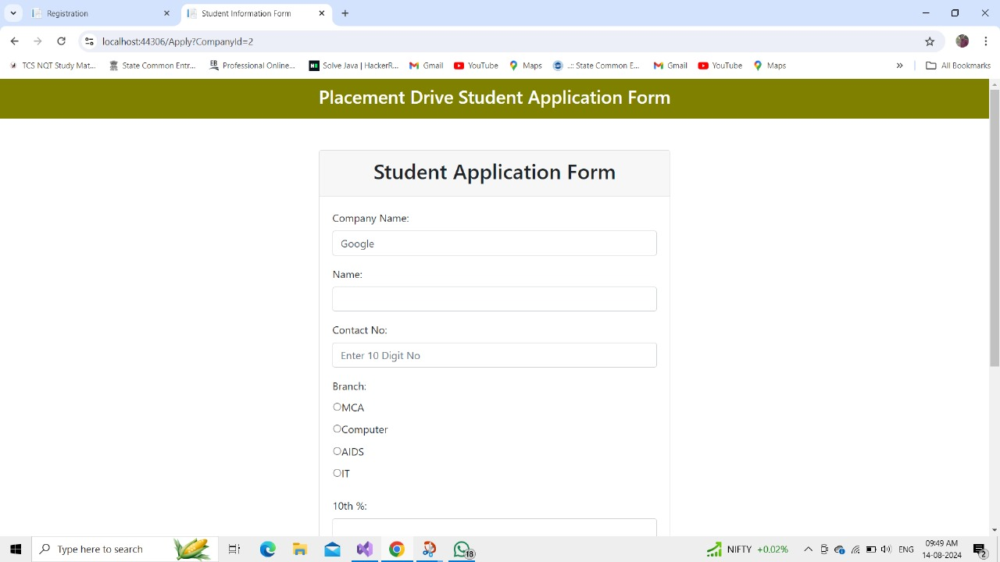
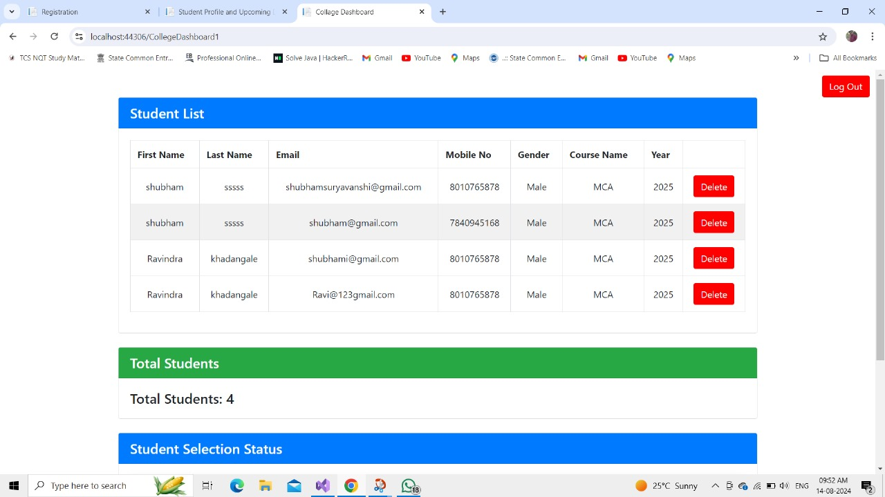
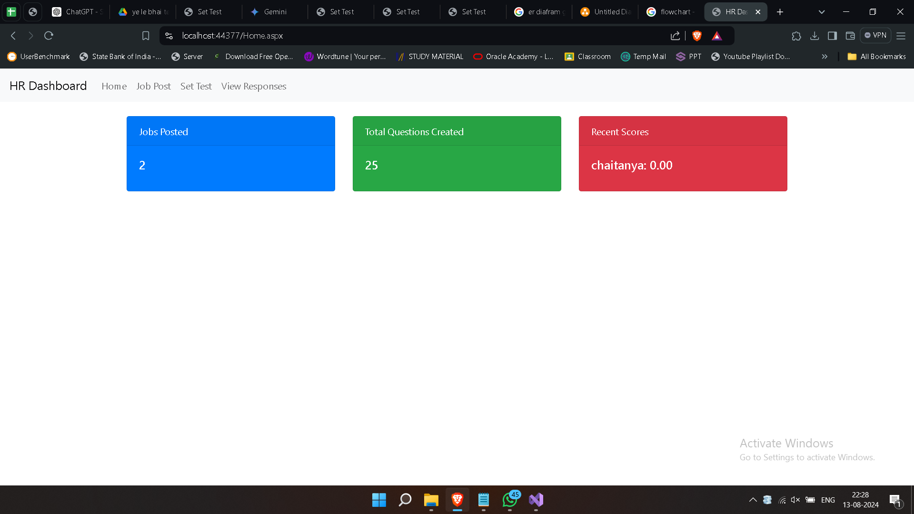
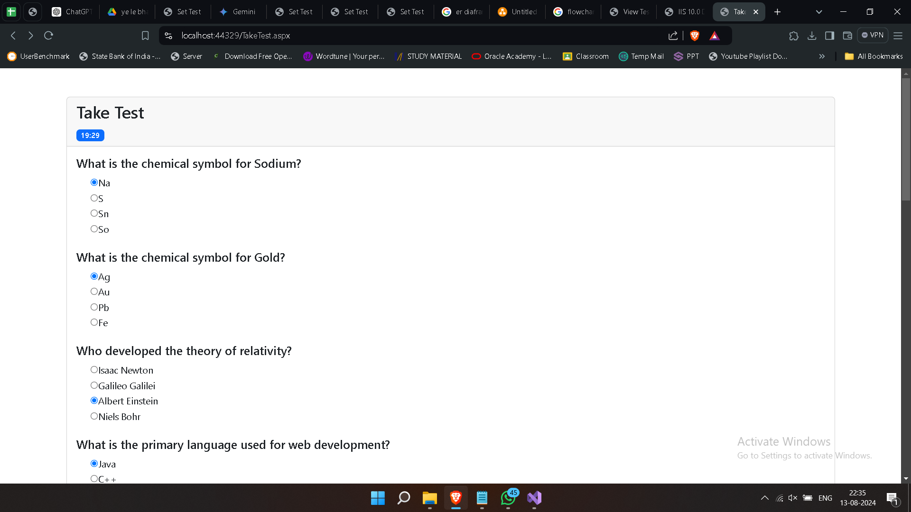

# Placement Management System

The **Placement Drive Portal** is a comprehensive web application designed to streamline and manage campus recruitment processes. This platform is tailored for colleges, students, and HR representatives, offering them a user-friendly interface to handle placement-related activities efficiently.

## Features

- **Student Dashboard**: 
  - View and apply for job opportunities.
  - Track application status.
  - Update personal profile and resume.

- **HR Dashboard**: 
  - Post job openings.
  - View applicant details.
  - Schedule and manage interviews.

- **Admin Dashboard**: 
  - Manage Comapanies and Students.
  - Oversee job postings and applications.
  - Generate reports on placement activities.

- **Responsive Design**: 
  - Optimized for both mobile and desktop viewing.

## Roles and Responsibilities

### Admin
- Manages all Students.
- Oversees job postings and applications.
- Generates placement reports.

### Student
- Updates profile and resume.
- Applies for jobs.
- Tracks application status.

### Recruiter (HR)
- Posts job openings.
- Reviews applications.
- Shortlists candidates for interviews by Test Marks.

## Screenshots

### Home Page


### Student Application Form


### College Dashboard


### HR Dashboard


### Aptitude Test



## How to Run the Project

1. Clone the repository:
   ```bash
   git clone https://github.com/chaitanya7x/Symbiosis_Training_Placement-Management-System-with-online-Test.git

## Acknowledgments

We would like to thank our college and mentors for their support throughout the development of this project. Special thanks to:

- **Vinaya Mam:** For providing invaluable training and guidance that helped us in the development of this project.
- **Jaspreet Mam:** For giving us the opportunity to attend the training and supporting our learning journey.

## Contributors

- [Chaitanya Mate](https://github.com/chaitanya7x)
- [Shubham Suryawanshi](https://github.com/shubham-suryawansh)
- [Ravindra Khadangle](https://github.com/Ravindra-Khadangale)
- [Ajay Kedar](https://github.com/ajaykedar123)
- [Gaurav Kapade](https://github.com/gauravkapade15)

## Contact

For any inquiries or support, please contact us at:

- **Email:** 1002matechm@gmail.com
- **GitHub:** [chaitanya7x](https://github.com/chaitanya7x)
